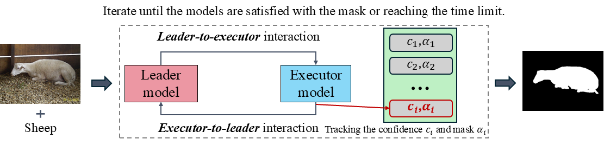

# Open-Vocabulary Self-Interactive Semantic Segmentation

Official implementation of the ICONIP 2024 paper "Open-Vocabulary Self-Interactive Semantic Segmentation."
<!-- [Open-Vocabulary Self-Interactive Semantic Segmentation](https://xxx).  -->

<p align="middle">
    
</p>

## Data Preparation

We follow the data preparation of [HSNet](https://github.com/juhongm999/hsnet). Please prepare for the Pascal-5i and COCO-20i datasets.

## Model Preparation

Our method requires **no training**. We use [SAM](https://huggingface.co/docs/transformers/main/en/model_doc/sam) as the interactive image segmentation model and use [LSeg](https://github.com/isl-org/lang-seg) as the open vocabulary semantic segmentation model. Please download the pre-trained [weights](https://github.com/isl-org/lang-seg?tab=readme-ov-file#model-zoo) for LSeg trained on the Pascal-5i and COCO-20i datasets.

## Open Vocabulary Semantic Segmentation

Reproduce our results with ease! Random seeds have been set. To replicate all experiments, simply run the following command:

```
python run_all_experiments.py
```

## Acknowledgement
Thanks to the code base from [LSeg](https://github.com/isl-org/lang-seg), [HSNet](https://github.com/juhongm999/hsnet), and [SAM](https://github.com/facebookresearch/segment-anything).

<!-- ## Citation
If you find our code or paper helps, please consider citing:
```
``` -->
